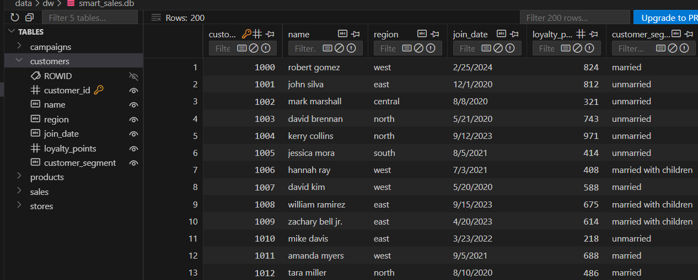
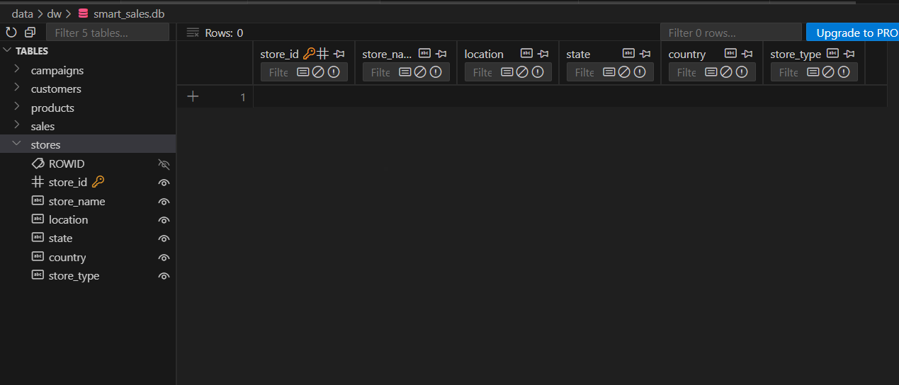
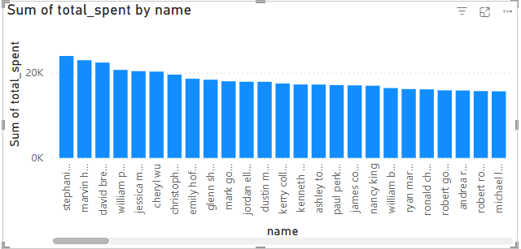

# smart-store-brittany

To get this project running, on Windows follow the following instructions.

### 1. Activate your environment

You must first activate `.venv` by running this command:

```sh
.\.venv\Scripts\Activate
```

**Note:** you may experience this error:

```sh
PS C:\Repos\smart-store-brittany> .\.venv\Scripts\activate
.\.venv\Scripts\activate : File C:\Repos\smart-store-brittany\.venv\Scripts\Activate.ps1 cannot be loaded because running scripts
is disabled on this system. For more information, see about_Execution_Policies at https:/go.microsoft.com/fwlink/?LinkID=135170.
At line:1 char:1

 .\.venv\Scripts\activate

 + CategoryInfo          : SecurityError: (:) [], PSSecurityException
 + FullyQualifiedErrorId : UnauthorizedAccess
```

If so, do the following:

1.  Open Windows Start Menu
2.  Search for Power Shell, right-click and select "Run As Administrator"
3.  Run this command:

    ```sh
    Set-ExecutionPolicy -ExecutionPolicy RemoteSigned -Scope CurrentUser
    ```

4.  Confirm with `Y` when prompted
5.  Try running the initial "Activate" command above now. You should no longer see the error.

### 2. Install dependencies

Once our environment is activated we now need to install any dependencies we have listed in `requirements.txt`. To do so, run the following command:

```sh
pip install -r requirements.txt
```

If an update is necessary, run:

```sh
pip install --upgrade pip
```

### 3. Prep the data

To prepare/check our data, we have Python scripts under `scripts/data_preparation`. Run them like this:

```sh
py scripts\data_preparation\prepare_customers_data.py
py scripts\data_preparation\prepare_products_data.py
py scripts\data_preparation\prepare_sales_data.py
```

**Note:** These scripts will use helpers coming from DataScrubber in `scripts\data_scrubber.py`

### 4. Testing

In order to test our DataScrubber class, which provides methods for data prep scripts, we run the tests in `tests\test_data_scrubber.py` as such:

```sh
py -m unittest tests/test_data_scrubber.py
```

### 5. Data Warehouse Design

My data warehouse follows a star schema design. The central fact table is the `sales` table, which records individual transactions. This is surrounded by several dimension tables, including `customers`, `products`, `stores`, and `campaigns`, each providing descriptive context for analysis.

#### Schema Implementation

Fact Table: `sales`

Contains measurable data such as sale_amount, and foreign keys to dimension tables.

```sql
CREATE TABLE IF NOT EXISTS sales (
    sale_id INTEGER PRIMARY KEY,
    customer_id INTEGER,
    product_id INTEGER,
    store_id INTEGER,
    campaign_id INTEGER,
    sale_amount REAL,
    sale_date TEXT,
    bonus_points INTEGER,
    payment_type TEXT,
    FOREIGN KEY (customer_id) REFERENCES customer (customer_id),
    FOREIGN KEY (product_id) REFERENCES product (product_id)
)
```

Dimension Table: `customers`

Holds customer demographics and identifiers.

```sql
CREATE TABLE IF NOT EXISTS customers (
    customer_id INTEGER PRIMARY KEY,
    name TEXT,
    region TEXT,
    join_date TEXT,
    loyalty_points INTEGER,
    customer_segment TEXT
)
```

Dimension Table: `products`

Contains product names, categories, and pricing data.

```sql
CREATE TABLE IF NOT EXISTS products (
    product_id INTEGER PRIMARY KEY,
    product_name TEXT,
    category TEXT,
    unit_price INTEGER,
    stock_quantity INTEGER,
    supplier TEXT
)
```

Dimension Table: `stores`

Describes physical or digital store locations.

```sql
 CREATE TABLE stores (
    store_id INTEGER PRIMARY KEY,
    store_name TEXT NOT NULL,
    location TEXT,
    state TEXT,
    country TEXT,
    store_type TEXT
)
```

Dimension Table: `campaigns`

Includes marketing campaign metadata.

```sql
CREATE TABLE campaigns (
    campaign_id INTEGER PRIMARY KEY,
    campaign_name TEXT NOT NULL,
    start_date DATE,
    end_date DATE,
    channel TEXT,
    budget_usd REAL
)
```

#### Design Choices

I chose a star schema to simplify query performance and support fast queries.

#### Challenges Encountered

Handling missing or inconsistent column names in source data. I had to go back and modify my data scrubber to support this in order to come up with column names that matched what was expected at time of loading back to the database.

#### Screenshots for the table structures







### 6. Cross-Platform Reporting with Power BI

#### SQL queries and reports

- Top Customers
- Sales by Region
- Sales by Category per Region
- Sales by Customers

#### Screenshot: Power BI Model View / Spark SQL Schema


#### Screenshot: Query results


#### Screenshot: Final Dashboard / Charts




## Things to remember

The following are things to refresh my memory:

### Submitting code via git

Add, commit with message, push to Github.

NOTE: Messages should be in present tense.

```sh
git add .
git commit -m "Add starter files"
git push
```
